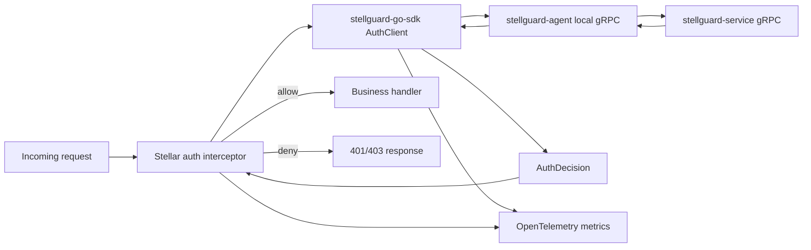

# StellGuard Go SDK

English | [Simplified Chinese](README_CN.md)

`stellguard-go-sdk` is the framework-neutral Go authentication client for the StellGuard zero-trust identity system. It is designed to be integrated into [stellar](https://github.com/stellhub/stellar) as the authentication backend for HTTP and gRPC interceptors.

The SDK talks to the local [stellguard-agent](https://github.com/stellhub/stellguard-agent) over gRPC. The agent is responsible for communicating with [stellguard-service](https://github.com/stellhub/stellguard-service), maintaining identity state, synchronizing policy context, and returning a final authentication decision to the workload process.

## Positioning

- `stellguard-service` is the central authentication control plane.
- `stellguard-agent` runs beside workloads and mediates local identity, policy, and service communication.
- `stellguard-go-sdk` is the in-process Go client used by applications and framework adapters.
- `stellar` can wrap the SDK with HTTP and gRPC interceptors while keeping the core SDK independent from framework lifecycle concerns.

The SDK should expose a compact result-oriented API: given a request authentication context, it returns whether the request is allowed, why it failed when it failed, and which low-cardinality attributes should be recorded for observability and governance.

## Architecture



Design boundaries:

- The SDK only connects to the local agent. Applications should not call `stellguard-service` directly.
- The SDK is an authentication client, not a framework interceptor implementation.
- Framework adapters extract request context, call the SDK, and convert decisions into HTTP or gRPC behavior.
- The agent owns remote service communication, agent sessions, policy cache, and identity lifecycle.
- The SDK owns agent calls, timeout handling, failure classification, decision normalization, and OpenTelemetry metrics.

For the full architecture notes, see [docs/architecture.md](docs/architecture.md).

## Package Layout

The root package exposes the stable SDK API: `AuthClient`, `Client`, `Options`, authentication request/decision types, credential helpers, trust bundle reads, and agent status reads.

Internal implementation is split by responsibility:

| Package | Responsibility |
| --- | --- |
| `internal/agenttransport` | Unix Domain Socket gRPC dialing and agent transport boundary checks. |
| `internal/authn` | Workload credential validation, peer certificate verification, and SPIFFE trust domain checks. |
| `internal/observability` | OpenTelemetry metric instruments and low-cardinality metric attributes. |

The protobuf contract and generated code live under `proto/stellguard/agent/v1`.

## Authentication Semantics

Authentication failures are split into two independent domains.

| Failure domain | Examples | Default policy | Operational meaning |
| --- | --- | --- | --- |
| Real authentication failure | Missing credentials, invalid token, revoked identity, policy denial | Deny | The request is not trusted and should be blocked by default. |
| Agent failure | Agent socket missing, gRPC timeout, `Unavailable`, agent internal error | Allow | The authentication infrastructure is degraded, so the request is allowed by default and the failure is recorded. |

This distinction is the core behavior expected by future `stellar` interceptors:

- Real authentication failures default to `deny`, but can be switched to `allow` for observation mode or gradual rollout.
- Agent failures default to `allow`, but can be switched to `deny` in high-security deployments.
- Agent failures should be reported as degraded authentication infrastructure, not as user authentication failures.
- Real authentication failures should record request source information for later governance and audit analysis.

## Public API Direction

The stable SDK surface should remain small and framework-neutral:

```go
type AuthClient interface {
    Authenticate(ctx context.Context, req AuthRequest) (AuthDecision, error)
    Close() error
}
```

`AuthDecision` is the primary source of truth for interceptor behavior. A non-nil `error` represents an SDK or transport-level problem; framework adapters should still map it into a classified decision before deciding whether to allow or deny the request.

Suggested decision model:

```go
type FailureKind string

const (
    FailureNone             FailureKind = "none"
    FailureUnauthenticated  FailureKind = "unauthenticated"
    FailureUnauthorized     FailureKind = "unauthorized"
    FailureAgentUnavailable FailureKind = "agent_unavailable"
    FailureAgentTimeout     FailureKind = "agent_timeout"
    FailureAgentError       FailureKind = "agent_error"
    FailureInvalidRequest   FailureKind = "invalid_request"
)
```

Recommended classification:

- `unauthenticated`, `unauthorized`, and `invalid_request` are real authentication failures.
- `agent_unavailable`, `agent_timeout`, and `agent_error` are agent failure cases.
- `none` means authentication succeeded.

## Configuration

The SDK configuration should be stable and easy for `stellar` or other frameworks to map from their own configuration systems:

```yaml
stellguard:
  auth:
    enabled: true
    agent:
      target: unix:///var/run/stellguard/agent.sock
      timeout: 300ms
      fail_on_startup: false
    decision:
      require_peer_certificate: true
      auth_failure_policy: deny
      agent_failure_policy: allow
      record_source: true
    observability:
      metrics: true
      traces: true
      metric_prefix: stellguard.auth
```

| Field | Default | Description |
| --- | --- | --- |
| `enabled` | `true` | Enables the authentication client. |
| `agent.target` | `unix:///var/run/stellguard/agent.sock` | Local agent gRPC endpoint. |
| `agent.timeout` | `300ms` | Timeout for one authentication call. |
| `agent.fail_on_startup` | `false` | Whether startup should fail when the local agent is unavailable. |
| `decision.require_peer_certificate` | `true` | Requires an inbound peer certificate trusted by the local trust bundle. |
| `decision.auth_failure_policy` | `deny` | Default behavior for real authentication failures. |
| `decision.agent_failure_policy` | `allow` | Default behavior for agent failures. |
| `decision.record_source` | `true` | Records request source details for denied or bypassed requests. |
| `observability.metrics` | `true` | Enables OpenTelemetry metrics. |
| `observability.traces` | `true` | Enables trace spans around agent authentication calls. |
| `observability.metric_prefix` | `stellguard.auth` | Metric name prefix. |

## OpenTelemetry Metrics

The SDK should record low-cardinality metrics by default:

| Metric | Type | Description |
| --- | --- | --- |
| `stellguard.auth.requests` | Counter | Total authentication requests. |
| `stellguard.auth.decisions` | Counter | Authentication decisions by result and failure kind. |
| `stellguard.auth.denied` | Counter | Requests denied after a real authentication failure. |
| `stellguard.auth.bypassed` | Counter | Failed requests allowed by configuration. |
| `stellguard.auth.agent.failures` | Counter | Agent communication or execution failures. |
| `stellguard.auth.duration` | Histogram | End-to-end authentication decision latency. |
| `stellguard.auth.agent.duration` | Histogram | Local agent gRPC call latency. |

Recommended metric attributes:

- `protocol`
- `method`
- `route`
- `decision`
- `failure_kind`
- `failure_policy`
- `agent_target_type`
- `service_name`
- `source_zone`

Request source IP, raw tokens, cookies, full URLs, request bodies, and other high-cardinality or sensitive values should not be used as metric attributes.

## Request Source Recording

When authentication fails, the SDK and framework adapter should preserve enough source context for governance without leaking secrets.

Recommended fields:

- `source.ip`
- `source.port`
- `source.forwarded_for`
- `source.user_agent`
- `source.authority`
- `request.protocol`
- `request.method`
- `request.route`
- `request.id`
- `service.name`
- `service.namespace`
- `service.instance.id`

Do not record raw `Authorization` headers, tokens, cookies, private keys, full query strings, or request bodies.

## Stellar Integration

`stellar` should integrate this SDK through an adapter layer:

- HTTP interceptors extract request metadata, source information, route templates, and credentials.
- gRPC interceptors extract method names, peer information, metadata, and credentials.
- The adapter calls `AuthClient.Authenticate`.
- The adapter converts `AuthDecision` into transport behavior.
- Core SDK packages do not import `stellar`.

Suggested response mapping:

| Scenario | Default decision | HTTP | gRPC |
| --- | --- | --- | --- |
| Authentication succeeds | Allow | N/A | N/A |
| Missing credentials | Deny | `401` | `Unauthenticated` |
| Invalid credentials | Deny | `401` | `Unauthenticated` |
| Policy denial | Deny | `403` | `PermissionDenied` |
| Agent unavailable and configured to allow | Allow | N/A | N/A |
| Agent unavailable and configured to deny | Deny | `503` | `Unavailable` |

## Agent Contract Direction

The SDK-to-agent gRPC contract follows `workload.proto` from `stellguard-agent`:

```protobuf
service WorkloadCredentialService {
  rpc FetchWorkloadCredential(FetchWorkloadCredentialRequest) returns (WorkloadCredential);
  rpc WatchWorkloadCredential(WatchWorkloadCredentialRequest) returns (stream WorkloadCredential);
  rpc GetTrustBundle(GetTrustBundleRequest) returns (TrustBundle);
  rpc GetAgentStatus(GetAgentStatusRequest) returns (AgentStatus);
}
```

`Authenticate` calls `FetchWorkloadCredential` without requesting the private key and uses the optional `audience` field as the local identity filter. It then validates the inbound request peer certificate from `AuthRequest.PeerCertificatePEM` or the `tls.peer.certificate_pem` attribute against the returned `trust_bundle_pem`. Missing or untrusted peer certificates are classified as real authentication failures. `PermissionDenied` and `Unauthenticated` from the agent are also real authentication failures. `Unavailable`, `DeadlineExceeded`, `NotFound`, invalid agent credentials, and agent internal errors are classified as agent failures.

The SDK should not expose `stellguard-service` internal database, audit, CA rotation, or policy storage models. The agent may cache policy and identity context, but the SDK should consume only the local workload API result and normalize it into a stable decision.

## Development

Run tests:

```bash
go test ./...
```

Generate protobuf code when the agent-facing contract changes:

```bash
protoc --go_out=. --go-grpc_out=. --go_opt=paths=source_relative --go-grpc_opt=paths=source_relative proto/stellguard/agent/v1/workload.proto
```

## Non-goals

- The SDK does not call `stellguard-service` directly.
- The SDK does not implement a full policy engine.
- The SDK does not own agent sessions, node attestation, certificate rotation, or CA management.
- The SDK does not bind itself to `stellar` lifecycle APIs.
- The SDK does not decide how HTTP or gRPC responses are written; that belongs to framework adapters.
