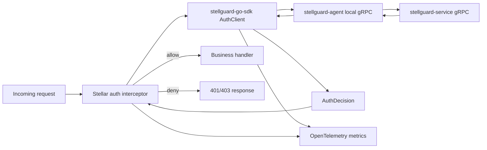

# StellGuard Go SDK

[English](README.md) | 简体中文

`stellguard-go-sdk` 是 StellGuard 零信任身份体系的 Go 认证客户端，保持框架无关设计。它未来会被集成到 [stellar](https://github.com/stellhub/stellar) 中，作为 HTTP 和 gRPC 认证拦截器背后的认证客户端。

SDK 通过 gRPC 调用本机 [stellguard-agent](https://github.com/stellhub/stellguard-agent)。agent 负责与 [stellguard-service](https://github.com/stellhub/stellguard-service) 通信，维护身份状态、同步策略上下文，并向 workload 进程返回最终认证决策。

## 定位

- `stellguard-service` 是中心侧认证控制面。
- `stellguard-agent` 运行在 workload 旁边，负责本地身份、策略和服务通信代理。
- `stellguard-go-sdk` 是业务进程内使用的 Go 认证客户端。
- `stellar` 可以在 SDK 之上封装 HTTP 和 gRPC 拦截器，同时让 SDK 核心包保持独立。

SDK 对外应该暴露紧凑的结果导向 API：输入一次请求认证上下文，返回请求是否允许、失败原因，以及可用于可观测性和治理的低基数字段。

## 架构



设计边界：

- SDK 只连接本机 agent，业务应用不应直接调用 `stellguard-service`。
- SDK 是认证客户端，不是完整的框架拦截器实现。
- 框架适配层负责提取请求上下文、调用 SDK，并把认证决策转换成 HTTP 或 gRPC 行为。
- agent 负责远端 service 通信、agent 会话、策略缓存和身份生命周期。
- SDK 负责 agent 调用、超时控制、失败分类、决策归一化和 OpenTelemetry 指标。

完整架构说明见 [docs/architecture.md](docs/architecture.md)。

## 包结构

根包暴露稳定 SDK API：`AuthClient`、`Client`、`Options`、认证请求/决策模型、凭据读取辅助 API、trust bundle 读取和 agent 状态读取。

内部实现按职责拆分：

| 包 | 职责 |
| --- | --- |
| `internal/agenttransport` | Unix Domain Socket gRPC 连接与 agent 传输边界校验。 |
| `internal/authn` | workload credential 完整性校验、peer certificate 校验和 SPIFFE trust domain 判断。 |
| `internal/observability` | OpenTelemetry metric instrument 创建和低基数指标属性规整。 |

protobuf 契约和生成代码位于 `proto/stellguard/agent/v1`。

## 认证语义

认证失败被拆分为两个独立失败域。

| 失败域 | 示例 | 默认策略 | 运维含义 |
| --- | --- | --- | --- |
| 真实认证失败 | 缺少凭据、token 非法、身份吊销、策略拒绝 | 拦截 | 请求本身不可信，默认应阻断。 |
| agent 故障 | agent socket 不存在、gRPC 超时、`Unavailable`、agent 内部错误 | 放行 | 认证基础设施处于降级状态，默认放行业务请求并记录故障。 |

这是未来 `stellar` 拦截器最核心的行为：

- 真实认证失败默认 `deny`，但可切换为 `allow`，用于观测模式或灰度接入。
- agent 故障默认 `allow`，但高安全场景可切换为 `deny`。
- agent 故障应该被报告为认证基础设施降级，而不是用户认证失败。
- 真实认证失败应记录请求来源，用于后续治理和审计分析。

## 公开 API 方向

SDK 稳定 API 应保持小而清晰，并且不绑定框架：

```go
type AuthClient interface {
    Authenticate(ctx context.Context, req AuthRequest) (AuthDecision, error)
    Close() error
}
```

`AuthDecision` 是拦截器行为的主要依据。非空 `error` 表示 SDK 或传输层问题；框架适配层仍应把它归一化为明确的认证决策，再决定放行或拦截。

建议的失败模型：

```go
type FailureKind string

const (
    FailureNone             FailureKind = "none"
    FailureUnauthenticated  FailureKind = "unauthenticated"
    FailureUnauthorized     FailureKind = "unauthorized"
    FailureAgentUnavailable FailureKind = "agent_unavailable"
    FailureAgentTimeout     FailureKind = "agent_timeout"
    FailureAgentError       FailureKind = "agent_error"
    FailureInvalidRequest   FailureKind = "invalid_request"
)
```

推荐分类：

- `unauthenticated`、`unauthorized`、`invalid_request` 属于真实认证失败。
- `agent_unavailable`、`agent_timeout`、`agent_error` 属于 agent 故障。
- `none` 表示认证成功。

## 配置

SDK 配置应该保持稳定，便于 `stellar` 或其他框架从自己的配置体系映射：

```yaml
stellguard:
  auth:
    enabled: true
    agent:
      target: unix:///var/run/stellguard/agent.sock
      timeout: 300ms
      fail_on_startup: false
    decision:
      require_peer_certificate: true
      auth_failure_policy: deny
      agent_failure_policy: allow
      record_source: true
    observability:
      metrics: true
      traces: true
      metric_prefix: stellguard.auth
```

| 字段 | 默认值 | 说明 |
| --- | --- | --- |
| `enabled` | `true` | 是否启用认证客户端。 |
| `agent.target` | `unix:///var/run/stellguard/agent.sock` | 本地 agent gRPC 地址。 |
| `agent.timeout` | `300ms` | 单次认证调用超时时间。 |
| `agent.fail_on_startup` | `false` | 启动时 agent 不可用是否直接失败。 |
| `decision.require_peer_certificate` | `true` | 是否要求入站请求提供可由本地 trust bundle 校验的 peer certificate。 |
| `decision.auth_failure_policy` | `deny` | 真实认证失败时的默认行为。 |
| `decision.agent_failure_policy` | `allow` | agent 故障时的默认行为。 |
| `decision.record_source` | `true` | 是否记录失败或放行请求的来源信息。 |
| `observability.metrics` | `true` | 是否启用 OpenTelemetry 指标。 |
| `observability.traces` | `true` | 是否围绕 agent 认证调用创建 trace span。 |
| `observability.metric_prefix` | `stellguard.auth` | 指标名前缀。 |

## OpenTelemetry 指标

SDK 默认应记录低基数、可聚合的指标：

| 指标名 | 类型 | 说明 |
| --- | --- | --- |
| `stellguard.auth.requests` | Counter | 认证请求总数。 |
| `stellguard.auth.decisions` | Counter | 按决策结果和失败类型统计认证结果。 |
| `stellguard.auth.denied` | Counter | 真实认证失败并最终拦截的请求数。 |
| `stellguard.auth.bypassed` | Counter | 因配置放行的失败请求数。 |
| `stellguard.auth.agent.failures` | Counter | agent 通信或执行失败次数。 |
| `stellguard.auth.duration` | Histogram | 端到端认证决策耗时。 |
| `stellguard.auth.agent.duration` | Histogram | 本地 agent gRPC 调用耗时。 |

推荐指标属性：

- `protocol`
- `method`
- `route`
- `decision`
- `failure_kind`
- `failure_policy`
- `agent_target_type`
- `service_name`
- `source_zone`

请求来源 IP、原始 token、cookie、完整 URL、请求 body 等高基数或敏感信息不应作为 metric attribute。

## 请求来源记录

认证失败时，SDK 和框架适配层应保留足够的来源上下文，服务于后续治理，同时避免泄漏密钥。

建议字段：

- `source.ip`
- `source.port`
- `source.forwarded_for`
- `source.user_agent`
- `source.authority`
- `request.protocol`
- `request.method`
- `request.route`
- `request.id`
- `service.name`
- `service.namespace`
- `service.instance.id`

不要记录原始 `Authorization` header、token、cookie、私钥、完整 query string 或请求 body。

## Stellar 集成

`stellar` 应通过适配层集成 SDK：

- HTTP 拦截器提取请求元数据、来源信息、路由模板和认证凭据。
- gRPC 拦截器提取 method、peer、metadata 和认证凭据。
- 适配层调用 `AuthClient.Authenticate`。
- 适配层把 `AuthDecision` 转换成传输层行为。
- SDK 核心包不导入 `stellar`。

建议响应映射：

| 场景 | 默认决策 | HTTP | gRPC |
| --- | --- | --- | --- |
| 认证成功 | 放行 | N/A | N/A |
| 缺少凭据 | 拦截 | `401` | `Unauthenticated` |
| 凭据不合法 | 拦截 | `401` | `Unauthenticated` |
| 策略拒绝 | 拦截 | `403` | `PermissionDenied` |
| agent 不可用且配置放行 | 放行 | N/A | N/A |
| agent 不可用且配置拦截 | 拦截 | `503` | `Unavailable` |

## Agent 契约方向

SDK 到 agent 的 gRPC 契约以 `stellguard-agent` 的 `workload.proto` 为准：

```protobuf
service WorkloadCredentialService {
  rpc FetchWorkloadCredential(FetchWorkloadCredentialRequest) returns (WorkloadCredential);
  rpc WatchWorkloadCredential(WatchWorkloadCredentialRequest) returns (stream WorkloadCredential);
  rpc GetTrustBundle(GetTrustBundleRequest) returns (TrustBundle);
  rpc GetAgentStatus(GetAgentStatusRequest) returns (AgentStatus);
}
```

`Authenticate` 会调用 `FetchWorkloadCredential`，且不会请求私钥，并使用可选 `audience` 作为本地身份过滤条件。随后 SDK 会使用返回的 `trust_bundle_pem` 校验 `AuthRequest.PeerCertificatePEM` 或 `tls.peer.certificate_pem` attribute 中的入站 peer certificate。缺失或不可信的 peer certificate 会被归类为真实认证失败；agent 返回的 `PermissionDenied` 和 `Unauthenticated` 同样会被归类为真实认证失败；`Unavailable`、`DeadlineExceeded`、`NotFound`、异常 agent credential 以及 agent 内部错误会被归类为 agent 故障。

SDK 不应暴露 `stellguard-service` 内部数据库、审计、CA 轮换或策略存储模型。agent 可以缓存策略和身份上下文，但 SDK 只消费本地 workload API 结果，并将其归一化为稳定认证决策。

## 开发

运行测试：

```bash
go test ./...
```

agent-facing 契约变化时重新生成 protobuf 代码：

```bash
protoc --go_out=. --go-grpc_out=. --go_opt=paths=source_relative --go-grpc_opt=paths=source_relative proto/stellguard/agent/v1/workload.proto
```

## 非目标

- SDK 不直接调用 `stellguard-service`。
- SDK 不实现完整策略引擎。
- SDK 不负责 agent 会话、节点证明、证书轮换或 CA 管理。
- SDK 不绑定 `stellar` 生命周期 API。
- SDK 不决定 HTTP 或 gRPC 响应如何写出，这属于框架适配层职责。
