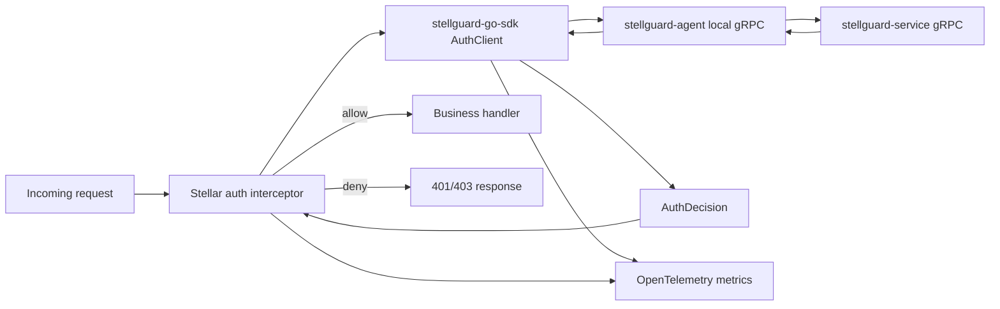
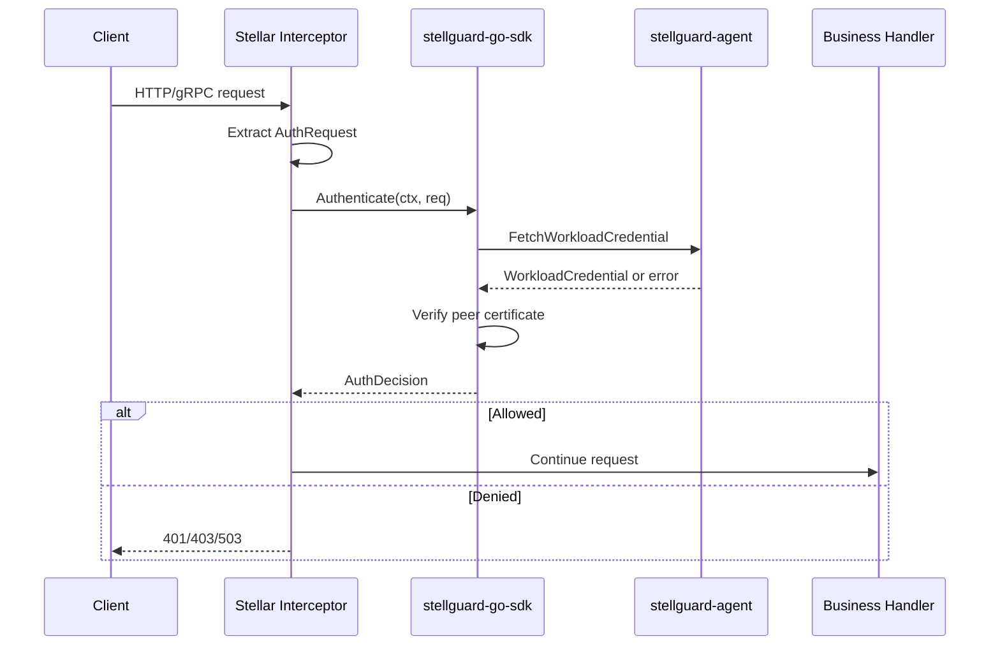

# StellGuard Go SDK 架构设计

## 1. 背景与目标

`stellguard-go-sdk` 是 `stellar` 未来认证拦截器的底层认证客户端。它不直接对接 `stellguard-service`，而是通过本机 `stellguard-agent` 暴露的 gRPC 接口完成请求认证。`stellguard-agent` 负责与中心侧 `stellguard-service` 建立会话、同步身份与策略、上报状态，并通过 gRPC 与服务端交互。

SDK 对上层框架暴露的核心能力应尽量简单：接收一次请求认证上下文，返回认证是否通过、失败原因、可观测性标签和可用于后续治理的请求来源信息。

核心目标：

- 为 `stellar` 提供框架无关的 `AuthClient`，后续由 `stellar` 封装为 HTTP/gRPC 认证拦截器。
- 只与本机 `stellguard-agent` 通信，不让业务进程直接调用 `stellguard-service`。
- 明确区分真实认证失败与 agent 通信失败。
- 默认策略安全且可用：真实认证失败默认拦截，agent 故障默认放行。
- 使用 OpenTelemetry 记录认证决策、失败类型、agent 可用性和延迟指标。
- 在认证失败时记录请求来源，为后续风控、治理、审计和策略优化提供依据。

## 2. 相关组件

| 组件 | 职责 |
| --- | --- |
| `stellguard-service` | StellGuard 认证控制面，维护身份、策略、证书、agent 会话、审计事件，并通过 HTTP/gRPC 对 agent 提供服务能力。 |
| `stellguard-agent` | 工作负载所在节点的本地身份代理，负责与 service 通信，并向本机 workload 暴露认证与身份材料能力。 |
| `stellguard-go-sdk` | 业务进程内的 Go SDK，只连接本地 agent，提供框架无关的认证客户端 API。 |
| `stellar` | Go 微服务框架，未来通过 HTTP/gRPC 拦截器集成 SDK，将认证结果转化为框架请求处理行为。 |

## 3. 总体架构



设计边界：

- SDK 是认证客户端，不是完整拦截器框架。
- SDK 不依赖 `stellar`，避免把框架生命周期、路由和传输细节泄漏进核心包。
- `stellar` 负责从 HTTP/gRPC 请求中提取认证上下文、调用 SDK、执行放行或拦截。
- `stellguard-agent` 负责和 `stellguard-service` 的远端协议、会话、策略缓存和故障恢复。
- SDK 负责 agent 调用、结果归一化、错误分类、OpenTelemetry 指标和可治理上下文输出。

## 3.1 包结构

根包 `github.com/stellhub/stellguard-go-sdk` 只暴露框架无关的 public API，包括 `AuthClient`、`Client`、`Options`、认证请求/结果模型、凭据读取辅助 API 和 agent 状态 API。

内部实现按职责放入 `internal/`：

| 包 | 职责 |
| --- | --- |
| `internal/agenttransport` | 负责 agent workload gRPC 的 Unix Domain Socket 连接和传输边界校验。 |
| `internal/authn` | 负责本地 workload credential 完整性校验、peer certificate 校验和 SPIFFE trust domain 判断。 |
| `internal/observability` | 负责 OpenTelemetry metrics 的创建、属性规整和记录。 |

`proto/stellguard/agent/v1` 保存 agent-facing protobuf 契约和生成代码。业务方不应直接依赖 `internal/` 包，未来 `stellar` adapter 也应只依赖根包公开 API。

## 4. 公开 API 方向

SDK 对上层暴露一个小而稳定的认证客户端：

```go
type AuthClient interface {
    Authenticate(ctx context.Context, req AuthRequest) (AuthDecision, error)
    Close() error
}
```

`Authenticate` 的返回语义应以 `AuthDecision` 为准。`error` 只表示 SDK 自身无法完成调用或输入不合法等技术错误，拦截器不应只靠 `error != nil` 判断是否拦截。

建议的请求模型：

```go
type AuthRequest struct {
    RequestID          string
    Protocol           string
    Method             string
    Path               string
    Operation          string
    Audience           string
    PeerCertificatePEM string
    ExpectedPrincipal  string
    AllowedPrincipals  []string
    Source             RequestSource
    Headers            map[string]string
    Attributes         map[string]string
}
```

建议的结果模型：

```go
type AuthDecision struct {
    Allowed        bool
    FailureKind    FailureKind
    Reason         string
    Principal      string
    LocalPrincipal string
    IdentityID      string
    PolicyID        string
    Source          RequestSource
    Metrics         MetricAttributes
}
```

建议的失败类型：

```go
type FailureKind string

const (
    FailureNone             FailureKind = "none"
    FailureUnauthenticated  FailureKind = "unauthenticated"
    FailureUnauthorized     FailureKind = "unauthorized"
    FailureAgentUnavailable FailureKind = "agent_unavailable"
    FailureAgentTimeout     FailureKind = "agent_timeout"
    FailureAgentError       FailureKind = "agent_error"
    FailureInvalidRequest   FailureKind = "invalid_request"
    FailureClientClosed     FailureKind = "client_closed"
    FailureRequestCanceled  FailureKind = "request_canceled"
)
```

其中：

- `unauthenticated`、`unauthorized`、`invalid_request` 属于真实认证失败，默认拦截。
- `agent_unavailable`、`agent_timeout`、`agent_error` 属于 agent 故障导致的认证失败，默认放行。
- `none` 表示认证成功。

## 5. 认证决策策略

SDK 需要把认证结果拆成两个决策域。

### 5.1 真实认证失败

真实认证失败表示 agent 已经正常返回认证结果，但请求本身不可信或不满足策略，例如：

- 缺少认证凭据。
- 凭据格式错误或签名无效。
- 身份已过期、被吊销或不属于当前 trust domain。
- 请求来源、服务身份、路径、方法或策略绑定不匹配。

默认行为：

- `Allowed=false`。
- `FailureKind=unauthenticated` 或 `unauthorized`。
- 拦截器默认返回 `401` 或 `403`。
- 记录请求来源、协议、方法、路径模板、失败类型和策略信息。

可配置行为：

- 允许将真实认证失败配置为放行，用于灰度接入、观测模式或治理试运行。
- 即使配置为放行，也必须记录 `bypass_reason=auth_failure_permissive`，避免把真实失败误看成正常流量。

### 5.2 Agent 故障失败

agent 故障失败表示 SDK 未能从本地 agent 获得可靠认证结果，例如：

- Unix Domain Socket 不存在或无法连接。
- gRPC 返回 `Unavailable`、`DeadlineExceeded` 或连接被重置。
- agent 进程重启、卡顿、健康状态异常。
- agent 返回内部错误，无法完成认证判断。

默认行为：

- `Allowed=true`。
- `FailureKind=agent_unavailable`、`agent_timeout` 或 `agent_error`。
- 拦截器默认放行请求。
- 记录 degraded 指标，帮助平台识别认证链路故障窗口。

可配置行为：

- 高安全场景可将 agent 故障配置为拦截。
- 拦截时应返回 `503`，而不是 `401/403`，避免把平台故障误判为用户未授权。

## 6. 配置模型

建议配置保持 SDK 级别稳定，框架适配层只负责映射配置来源。

```yaml
stellguard:
  auth:
    enabled: true
    agent:
      target: unix:///var/run/stellguard/agent.sock
      timeout: 300ms
      fail_on_startup: false
    decision:
      require_peer_certificate: true
      auth_failure_policy: deny
      agent_failure_policy: allow
      record_source: true
    observability:
      metrics: true
      traces: true
      metric_prefix: stellguard.auth
```

字段语义：

| 字段 | 默认值 | 说明 |
| --- | --- | --- |
| `enabled` | `true` | 是否启用认证客户端。 |
| `agent.target` | `unix:///var/run/stellguard/agent.sock` | 本地 agent gRPC 地址。 |
| `agent.timeout` | `300ms` | 单次认证调用超时时间。 |
| `agent.fail_on_startup` | `false` | 启动时 agent 不可用是否直接失败。 |
| `decision.require_peer_certificate` | `true` | 是否要求入站请求提供可由 trust bundle 校验的 peer certificate。 |
| `decision.auth_failure_policy` | `deny` | 真实认证失败时默认拦截。 |
| `decision.agent_failure_policy` | `allow` | agent 故障时默认放行。 |
| `decision.record_source` | `true` | 是否记录认证失败请求来源。 |
| `observability.metrics` | `true` | 是否记录 OpenTelemetry metrics。 |
| `observability.traces` | `true` | 是否围绕 agent 调用创建 trace span。 |
| `observability.metric_prefix` | `stellguard.auth` | SDK 指标名前缀。 |

## 7. 请求来源记录

请求来源用于后续治理，不应该和认证凭据原文混在一起。

建议记录：

- `source.ip`：客户端 IP 或可信代理解析后的原始来源。
- `source.port`：客户端端口，存在时记录。
- `source.forwarded_for`：经过可信代理清洗后的 `X-Forwarded-For` 信息。
- `source.user_agent`：HTTP 场景下的 User-Agent，可按配置脱敏。
- `source.authority`：请求 Host 或 gRPC authority。
- `request.protocol`：`http`、`grpc` 或其他协议。
- `request.method`：HTTP method 或 gRPC method。
- `request.route`：低基数路径模板，避免直接记录高基数 URL。
- `request.id`：请求链路 ID。
- `service.name`、`service.namespace`、`service.instance.id`：当前 workload 元信息。

不建议记录：

- 原始 Authorization header。
- 原始 token、cookie、私钥、证书私钥。
- 高基数用户 ID、完整 URL query、完整 body。

## 8. OpenTelemetry 指标

SDK 应优先记录低基数、可聚合的 metrics。

建议指标：

| 指标名 | 类型 | 说明 |
| --- | --- | --- |
| `stellguard.auth.requests` | Counter | 认证请求总数。 |
| `stellguard.auth.decisions` | Counter | 按 `decision` 和 `failure_kind` 统计认证结果。 |
| `stellguard.auth.denied` | Counter | 真实认证失败并最终拦截的请求数。 |
| `stellguard.auth.bypassed` | Counter | 因配置放行的失败请求数。 |
| `stellguard.auth.agent.failures` | Counter | agent 通信失败次数。 |
| `stellguard.auth.duration` | Histogram | 单次认证决策耗时。 |
| `stellguard.auth.agent.duration` | Histogram | 单次 agent gRPC 调用耗时。 |

建议指标属性：

- `protocol`
- `method`
- `route`
- `decision`
- `failure_kind`
- `failure_policy`
- `agent_target_type`
- `service_name`
- `source_zone`

治理建议：

- `route` 必须使用路由模板，避免高基数路径。
- `source.ip` 默认不作为 metric attribute，可进入日志、审计事件或 trace event。
- 真实认证失败被配置放行时，必须记录 `failure_policy=allow`。
- agent 故障默认放行时，必须记录 `failure_kind=agent_unavailable|agent_timeout|agent_error`。

## 9. Trace 与日志

SDK 可以围绕 `Authenticate` 创建内部 span：

- span 名称：`StellGuard.Authenticate`
- span 属性：`stellguard.failure_kind`、`stellguard.decision`、`rpc.system=grpc`、`rpc.service`、`rpc.method`
- agent 调用失败时记录 exception event。
- 真实认证失败时记录 decision event，不建议把它作为 span error。

日志建议：

- agent 故障默认 `warn`，带故障类型、耗时和 agent target 类型。
- 真实认证失败默认 `info` 或 `warn`，取决于接入环境。
- 不输出敏感认证材料。
- 对高频认证失败日志做采样或限流。

## 10. Stellar 集成方式

未来 `stellar` 集成时应以适配器方式使用 SDK：



集成原则：

- `stellar` 拦截器负责协议适配，包括 HTTP 状态码、gRPC status code、路由模板、请求来源提取。
- SDK 负责认证调用、失败分类、指标记录和决策输出。
- core SDK 不引入 `stellar` 依赖。
- 如果需要提供开箱即用能力，可新增独立 adapter 包，例如 `adapters/stellar`，但不要污染核心 API。

建议状态码映射：

| 场景 | 默认决策 | HTTP | gRPC |
| --- | --- | --- | --- |
| 认证成功 | 放行 | N/A | N/A |
| 缺少凭据 | 拦截 | `401` | `Unauthenticated` |
| 凭据不合法 | 拦截 | `401` | `Unauthenticated` |
| 策略拒绝 | 拦截 | `403` | `PermissionDenied` |
| agent 不可用且配置放行 | 放行 | N/A | N/A |
| agent 不可用且配置拦截 | 拦截 | `503` | `Unavailable` |

## 11. Agent gRPC 契约方向

SDK 与 agent 的交互以 `workload.proto` 中的 `WorkloadCredentialService` 为准。该契约面向同机 workload 暴露当前凭据、trust bundle 和 agent 状态，而不是暴露 `stellguard-service` 内部模型。

当前 RPC 语义：

```protobuf
service WorkloadCredentialService {
  rpc FetchWorkloadCredential(FetchWorkloadCredentialRequest) returns (WorkloadCredential);
  rpc WatchWorkloadCredential(WatchWorkloadCredentialRequest) returns (stream WorkloadCredential);
  rpc GetTrustBundle(GetTrustBundleRequest) returns (TrustBundle);
  rpc GetAgentStatus(GetAgentStatusRequest) returns (AgentStatus);
}
```

在认证客户端语义中，SDK 通过 `FetchWorkloadCredential` 请求当前 workload 凭据，并传入可选 `audience` 作为本地身份过滤条件。随后 SDK 使用返回的 `trust_bundle_pem` 对入站请求携带的 `PeerCertificatePEM` 做本地 X.509 和 SPIFFE 校验：

- agent 调用成功且 peer certificate 被 trust bundle 信任，且 SPIFFE trust domain 匹配时，SDK 返回 `Allowed=true`。
- 请求未携带 peer certificate、证书无效或 principal 不符合 `ExpectedPrincipal` / `AllowedPrincipals` 时，归类为真实认证失败。
- `PermissionDenied` 或 `Unauthenticated` 表示本地身份不匹配或调用方不被允许读取该身份，归类为真实认证失败。
- `Unavailable`、`DeadlineExceeded`、`NotFound`、agent 内部错误或 agent 返回异常 credential 表示 SDK 无法获得可靠认证结果，归类为 agent 故障失败。
- `GetTrustBundle` 和 `GetAgentStatus` 作为辅助 API 暴露给上层，用于 TLS 校验材料读取、健康检查和排障。

协议约束：

- SDK 不应该理解 `stellguard-service` 的数据库模型、审计模型或 CA 轮换模型。
- agent 可以缓存策略、身份和凭据上下文，但 SDK 只消费本地 workload API 的结果。
- SDK 必须通过 gRPC 状态码把真实认证失败和 agent 故障失败归一化为稳定 `FailureKind`。

## 12. 故障处理矩阵

| 条件 | 失败域 | 默认策略 | 指标 | 说明 |
| --- | --- | --- | --- | --- |
| agent 返回 allow | 成功 | 放行 | `decision=allow` | 正常请求。 |
| agent 返回 unauthenticated | 真实认证失败 | 拦截 | `failure_kind=unauthenticated` | 凭据缺失或无效。 |
| agent 返回 unauthorized | 真实认证失败 | 拦截 | `failure_kind=unauthorized` | 策略不允许。 |
| SDK 请求参数不完整 | 真实认证失败 | 拦截 | `failure_kind=invalid_request` | 框架适配层传入上下文不完整。 |
| agent socket 不存在 | agent 故障 | 放行 | `failure_kind=agent_unavailable` | 本地 agent 未启动或 socket 丢失。 |
| agent 调用超时 | agent 故障 | 放行 | `failure_kind=agent_timeout` | 可能是 agent 卡顿或 service 依赖异常。 |
| agent 返回内部错误 | agent 故障 | 放行 | `failure_kind=agent_error` | agent 无法给出可靠认证结论。 |

## 13. 安全与治理原则

- 默认不绕过真实认证失败。
- 默认不因 agent 故障阻断业务请求，避免认证基础设施故障放大为业务不可用。
- agent 故障放行必须可观测，且可以按服务、环境、路由维度告警。
- 真实认证失败的放行只用于灰度、演练或观测模式，并应有明确指标和日志标识。
- SDK 不持久化敏感凭据。
- SDK 不输出认证材料原文。
- SDK 不把高基数字段作为 metric attribute。
- 请求来源记录必须可关闭，并允许上层框架做脱敏。

## 14. 演进路线

第一阶段：

- 定义 `AuthClient`、`AuthRequest`、`AuthDecision` 和失败分类。
- 完成本地 agent gRPC 调用与超时控制。
- 完成真实认证失败与 agent 故障失败的默认策略。
- 接入 OpenTelemetry metrics。

第二阶段：

- 增加 trace span 与结构化日志。
- 提供 HTTP/gRPC 请求来源提取辅助函数。
- 补充 agent 故障降级测试和真实认证失败策略测试。

第三阶段：

- 在 `stellar` 中提供认证拦截器适配。
- 支持观测模式、灰度放行和按路由策略切换。
- 将 SDK 指标接入 Stellar 统一 observability provider。

## 15. 非目标

- SDK 不直接调用 `stellguard-service`。
- SDK 不实现完整策略引擎。
- SDK 不实现 agent 会话、节点证明、证书轮换或 CA 管理。
- SDK 不绑定 `stellar` 生命周期。
- SDK 不负责把 HTTP/gRPC 请求转换成业务错误响应，该部分由框架适配层完成。
